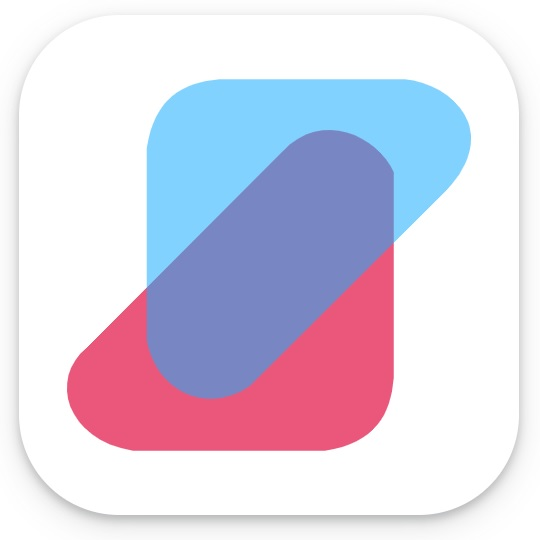

<div align="center">
<h1 align="center">

<br>SHOP APP</h1>

[](https://drive.google.com/uc?export=download&confirm=9iBg&id=1aYbu_jfjn-nUALQL96oychs_HDYic6dg) []() 

<h3>Buy anytime you want!<br>
Pay with any credit or debit card<br>
Compatible with Android & iOS devices</h3>

<p align="center">


</p>


</div>

---


https://github.com/jatolentino/Shop-Ecommerce-app/assets/61167951/8d4d85aa-13c7-48c6-89ca-9d7a8447e31b


---

## 📖 Table of Contents
- [📖 Table of Contents](#-table-of-contents)
- [📍 Overview](#-overview)
- [📦 Features](#-features)
- [📂 repository Structure](#-repository-structure)
- [⚙️ Modules](#modules)
- [🚀 Getting Started](#-getting-started)
    - [🔧 Installation](#-installation)
    - [🤖 Running Shop-Ecommerce-app](#-running-Shop-Ecommerce-app)
    - [🧪 Tests](#-tests)
- [🛣 Roadmap](#-roadmap)
- [🤝 Contributing](#-contributing)
- [📄 License](#-license)
- [👏 Acknowledgments](#-acknowledgments)

---


## 📍 Overview

Flutter mobile application project compatible with Android and iOS devices, it connects to a Mongo database through a Express API. The client and server projects are located at [https://github.com/jatolentino/Shop-Ecommerce](https://github.com/jatolentino/Shop-Ecommerce). The APK and IPA files fron Android and iOS can be generated with this project, but you can download the android app from this [link](https://drive.google.com/uc?export=download&confirm=9iBg&id=1aYbu_jfjn-nUALQL96oychs_HDYic6dg). Please generate your IPA file for iOS following the common flutter process.

---

## 📦 Features

| **Features**             | **Customer** | **App**  |
|--------------------------|------------|------------|
| Users Registration       |     ✔️    |     ✔️    |
| Users Login/Logout       |     ✔️    |     ✔️    |
| Reset Password           |     ✔️    |     ✔️    |
| Dashboard                |     ✔️    |     ✔️    |
| Add Products to your cart|     ✔️    |     ✔️    |
| Add Products to your favorites| ✔️   |     ✔️    |
| Search/filter products   |     ✔️    |     ✔️    |
| Credit/Debit card payment|     ✔️    |     ✔️    |
| Product tracking         |     ✔️    |     ✔️    |
| Terms & Condition        |     ➖    |     ✔️    |
| Privacy & Policy         |     ➖    |     ✔️    |
| Rating Products          |     ✔️    |     ✔️    |


---


## 📂 Repository Structure

```sh
└── Shop-Ecommerce-app/
    ├── .metadata
    ├── android/
    │   ├── app/
    │   │   ├── build.gradle
    │   │   └── src/
    │   ├── build.gradle
    │   ├── gradle/
    │   │   └── wrapper/
    │   ├── settings.gradle
    │   └── upload-keystore.jks
    ├── ios/
    │   ├── Flutter/
    │   │   ├── AppFrameworkInfo.plist
    │   │   ├── Debug.xcconfig
    │   │   └── Release.xcconfig
    │   ├── Runner/
    │   │   ├── AppDelegate.swift
    │   │   ├── Assets.xcassets/
    │   │   ├── Base.lproj/
    │   │   ├── Info.plist
    │   │   └── Runner-Bridging-Header.h
    │   ├── Runner.xcodeproj/
    │   │   ├── project.pbxproj
    │   │   ├── project.xcworkspace/
    │   │   └── xcshareddata/
    │   └── Runner.xcworkspace/
    │       ├── contents.xcworkspacedata
    │       └── xcshareddata/
    ├── lib/
    │   ├── config/
    │   │   └── routes/
    │   ├── constants/
    │   │   ├── api_path.dart
    │   │   ├── app_color.dart
    │   │   ├── app_constants.dart
    │   │   ├── app_text.dart
    │   │   ├── assets_path.dart
    │   │   └── size.dart
    │   ├── core/
    │   │   └── auth/
    │   ├── main.dart
    │   ├── module/
    │   │   ├── controller/
    │   │   ├── model/
    │   │   └── view/
    │   ├── utils/
    │   │   ├── helper/
    │   │   └── service/
    │   └── widgets/
    │       ├── account_text.dart
    │       ├── action_icon.dart
    │       ├── bottom_nav.dart
    │       ├── custom_app_bar.dart
    │       ├── custom_button.dart
    │       ├── header_text.dart
    │       ├── heading_text.dart
    │       ├── loading_indicator.dart
    │       ├── menu_drawer.dart
    │       ├── product_item.dart
    │       ├── search_delegate.dart
    │       ├── search_field.dart
    │       └── search_screen.dart
    ├── pubspec.lock
    ├── pubspec.yaml
    ├── test/
    │   └── widget_test.dart
    └── web/
        ├── icons/
        ├── index.html
        └── manifest.json

```

---


## ⚙️ Modules

<details closed><summary>Root</summary>

| File                                                                                     | Summary                                                                                                                                                                                                                                                                                                                                                                                                                                                                                                                                 |
| ---                                                                                      | ---                                                                                                                                                                                                                                                                                                                                                                                                                                                                                                                                     |
| [pubspec.yaml](https://github.com/jatolentino/Shop-Ecommerce-app/blob/main/pubspec.yaml) | The code above represents the pubspec.yaml file for a Flutter project called "shop". It includes the project name, description, version number, and environment specifications. It also lists the project dependencies, such as the Flutter SDK, various packages for features like icon fonts, HTTP requests, image caching, and more. Additionally, it specifies assets, including icons and images, that are used in the project. This file is crucial for managing project dependencies and assets in Flutter development.          |
| [pubspec.lock](https://github.com/jatolentino/Shop-Ecommerce-app/blob/main/pubspec.lock) | The code represents a directory tree structure for a Shop-Ecommerce-app. It consists of separate directories for Android and iOS, each containing files and folders relevant to their respective platforms. The "lib" directory contains various subdirectories for configuration, constants, core functionalities, modules, utilities, and widgets. These subdirectories have files with code for specific features and components required by the app, such as routes, models, controllers, views, helpers, services, and UI widgets. |
| [.metadata](https://github.com/jatolentino/Shop-Ecommerce-app/blob/main/.metadata)       | HTTPStatus Exception: 429                                                                                                                                                                                                                                                                                                                                                                                                                                                                                                               |

</details>

<details closed><summary>Web</summary>

| File                                                                                           | Summary                                                                                                                                                                                                                                                                                                                                                                                                                                                    |
| ---                                                                                            | ---                                                                                                                                                                                                                                                                                                                                                                                                                                                        |
| [manifest.json](https://github.com/jatolentino/Shop-Ecommerce-app/blob/main/web/manifest.json) | The code represents the manifest.json file for a Flutter project named "shop" in the web/ directory. The manifest contains metadata and configuration for a Progressive Web App (PWA), including the app's name, short name, start URL, display mode, background color, theme color, description, orientation, and icons in different sizes and types. This allows the app to be installed and launched as a standalone application on compatible devices. |
| [index.html](https://github.com/jatolentino/Shop-Ecommerce-app/blob/main/web/index.html)       | HTTPStatus Exception: 429                                                                                                                                                                                                                                                                                                                                                                                                                                  |

</details>

<details closed><summary>Lib</summary>

| File                                                                                   | Summary                   |
| ---                                                                                    | ---                       |
| [main.dart](https://github.com/jatolentino/Shop-Ecommerce-app/blob/main/lib/main.dart) | HTTPStatus Exception: 429 |

</details>

<details closed><summary>Constants</summary>

| File                                                                                                               | Summary                   |
| ---                                                                                                                | ---                       |
| [app_constants.dart](https://github.com/jatolentino/Shop-Ecommerce-app/blob/main/lib/constants/app_constants.dart) | HTTPStatus Exception: 429 |
| [app_text.dart](https://github.com/jatolentino/Shop-Ecommerce-app/blob/main/lib/constants/app_text.dart)           | HTTPStatus Exception: 429 |
| [assets_path.dart](https://github.com/jatolentino/Shop-Ecommerce-app/blob/main/lib/constants/assets_path.dart)     | HTTPStatus Exception: 429 |
| [size.dart](https://github.com/jatolentino/Shop-Ecommerce-app/blob/main/lib/constants/size.dart)                   | HTTPStatus Exception: 429 |
| [app_color.dart](https://github.com/jatolentino/Shop-Ecommerce-app/blob/main/lib/constants/app_color.dart)         | HTTPStatus Exception: 429 |
| [api_path.dart](https://github.com/jatolentino/Shop-Ecommerce-app/blob/main/lib/constants/api_path.dart)           | HTTPStatus Exception: 429 |

</details>

<details closed><summary>Auth</summary>

| File                                                                                                     | Summary                   |
| ---                                                                                                      | ---                       |
| [login.dart](https://github.com/jatolentino/Shop-Ecommerce-app/blob/main/lib/core/auth/login.dart)       | HTTPStatus Exception: 429 |
| [register.dart](https://github.com/jatolentino/Shop-Ecommerce-app/blob/main/lib/core/auth/register.dart) | HTTPStatus Exception: 429 |

</details>

<details closed><summary>Routes</summary>

| File                                                                                                           | Summary                   |
| ---                                                                                                            | ---                       |
| [app_route.dart](https://github.com/jatolentino/Shop-Ecommerce-app/blob/main/lib/config/routes/app_route.dart) | HTTPStatus Exception: 429 |

</details>

<details closed><summary>Helper</summary>

| File                                                                                                            | Summary                   |
| ---                                                                                                             | ---                       |
| [exception.dart](https://github.com/jatolentino/Shop-Ecommerce-app/blob/main/lib/utils/helper/exception.dart)   | HTTPStatus Exception: 429 |
| [bindings.dart](https://github.com/jatolentino/Shop-Ecommerce-app/blob/main/lib/utils/helper/bindings.dart)     | HTTPStatus Exception: 429 |
| [loader.dart](https://github.com/jatolentino/Shop-Ecommerce-app/blob/main/lib/utils/helper/loader.dart)         | HTTPStatus Exception: 429 |
| [dialog.dart](https://github.com/jatolentino/Shop-Ecommerce-app/blob/main/lib/utils/helper/dialog.dart)         | HTTPStatus Exception: 429 |
| [show_snack.dart](https://github.com/jatolentino/Shop-Ecommerce-app/blob/main/lib/utils/helper/show_snack.dart) | HTTPStatus Exception: 429 |

</details>

<details closed><summary>Payment</summary>

| File                                                                                                               | Summary                   |
| ---                                                                                                                | ---                       |
| [payment.dart](https://github.com/jatolentino/Shop-Ecommerce-app/blob/main/lib/utils/service/payment/payment.dart) | HTTPStatus Exception: 429 |

</details>

<details closed><summary>Api</summary>

| File                                                                                                                           | Summary                   |
| ---                                                                                                                            | ---                       |
| [auth_service.dart](https://github.com/jatolentino/Shop-Ecommerce-app/blob/main/lib/utils/service/api/auth_service.dart)       | HTTPStatus Exception: 429 |
| [product_service.dart](https://github.com/jatolentino/Shop-Ecommerce-app/blob/main/lib/utils/service/api/product_service.dart) | HTTPStatus Exception: 429 |
| [checkout.dart](https://github.com/jatolentino/Shop-Ecommerce-app/blob/main/lib/utils/service/api/checkout.dart)               | HTTPStatus Exception: 429 |

</details>

<details closed><summary>Widgets</summary>

| File                                                                                                                     | Summary                   |
| ---                                                                                                                      | ---                       |
| [search_delegate.dart](https://github.com/jatolentino/Shop-Ecommerce-app/blob/main/lib/widgets/search_delegate.dart)     | HTTPStatus Exception: 429 |
| [custom_app_bar.dart](https://github.com/jatolentino/Shop-Ecommerce-app/blob/main/lib/widgets/custom_app_bar.dart)       | HTTPStatus Exception: 429 |
| [menu_drawer.dart](https://github.com/jatolentino/Shop-Ecommerce-app/blob/main/lib/widgets/menu_drawer.dart)             | HTTPStatus Exception: 429 |
| [account_text.dart](https://github.com/jatolentino/Shop-Ecommerce-app/blob/main/lib/widgets/account_text.dart)           | HTTPStatus Exception: 429 |
| [loading_indicator.dart](https://github.com/jatolentino/Shop-Ecommerce-app/blob/main/lib/widgets/loading_indicator.dart) | HTTPStatus Exception: 429 |
| [action_icon.dart](https://github.com/jatolentino/Shop-Ecommerce-app/blob/main/lib/widgets/action_icon.dart)             | HTTPStatus Exception: 429 |
| [custom_button.dart](https://github.com/jatolentino/Shop-Ecommerce-app/blob/main/lib/widgets/custom_button.dart)         | HTTPStatus Exception: 429 |
| [product_item.dart](https://github.com/jatolentino/Shop-Ecommerce-app/blob/main/lib/widgets/product_item.dart)           | HTTPStatus Exception: 429 |
| [search_screen.dart](https://github.com/jatolentino/Shop-Ecommerce-app/blob/main/lib/widgets/search_screen.dart)         | HTTPStatus Exception: 429 |
| [search_field.dart](https://github.com/jatolentino/Shop-Ecommerce-app/blob/main/lib/widgets/search_field.dart)           | HTTPStatus Exception: 429 |
| [bottom_nav.dart](https://github.com/jatolentino/Shop-Ecommerce-app/blob/main/lib/widgets/bottom_nav.dart)               | HTTPStatus Exception: 429 |
| [heading_text.dart](https://github.com/jatolentino/Shop-Ecommerce-app/blob/main/lib/widgets/heading_text.dart)           | HTTPStatus Exception: 429 |
| [header_text.dart](https://github.com/jatolentino/Shop-Ecommerce-app/blob/main/lib/widgets/header_text.dart)             | HTTPStatus Exception: 429 |

</details>

<details closed><summary>Model</summary>

| File                                                                                                                    | Summary                   |
| ---                                                                                                                     | ---                       |
| [user_model.dart](https://github.com/jatolentino/Shop-Ecommerce-app/blob/main/lib/module/model/user_model.dart)         | HTTPStatus Exception: 429 |
| [product_model.dart](https://github.com/jatolentino/Shop-Ecommerce-app/blob/main/lib/module/model/product_model.dart)   | HTTPStatus Exception: 429 |
| [banner_model.dart](https://github.com/jatolentino/Shop-Ecommerce-app/blob/main/lib/module/model/banner_model.dart)     | HTTPStatus Exception: 429 |
| [category_model.dart](https://github.com/jatolentino/Shop-Ecommerce-app/blob/main/lib/module/model/category_model.dart) | HTTPStatus Exception: 429 |
| [checkout_model.dart](https://github.com/jatolentino/Shop-Ecommerce-app/blob/main/lib/module/model/checkout_model.dart) | HTTPStatus Exception: 429 |
| [my_order_model.dart](https://github.com/jatolentino/Shop-Ecommerce-app/blob/main/lib/module/model/my_order_model.dart) | HTTPStatus Exception: 429 |

</details>

<details closed><summary>Controller</summary>

| File                                                                                                                           | Summary                   |
| ---                                                                                                                            | ---                       |
| [auth_controller.dart](https://github.com/jatolentino/Shop-Ecommerce-app/blob/main/lib/module/controller/auth_controller.dart) | HTTPStatus Exception: 429 |
| [data_controller.dart](https://github.com/jatolentino/Shop-Ecommerce-app/blob/main/lib/module/controller/data_controller.dart) | HTTPStatus Exception: 429 |
| [cart_controller.dart](https://github.com/jatolentino/Shop-Ecommerce-app/blob/main/lib/module/controller/cart_controller.dart) | HTTPStatus Exception: 429 |
| [app_controller.dart](https://github.com/jatolentino/Shop-Ecommerce-app/blob/main/lib/module/controller/app_controller.dart)   | HTTPStatus Exception: 429 |
| [base_controller.dart](https://github.com/jatolentino/Shop-Ecommerce-app/blob/main/lib/module/controller/base_controller.dart) | HTTPStatus Exception: 429 |

</details>

<details closed><summary>View</summary>

| File                                                                                                               | Summary                   |
| ---                                                                                                                | ---                       |
| [landing_page.dart](https://github.com/jatolentino/Shop-Ecommerce-app/blob/main/lib/module/view/landing_page.dart) | HTTPStatus Exception: 429 |
| [splash.dart](https://github.com/jatolentino/Shop-Ecommerce-app/blob/main/lib/module/view/splash.dart)             | HTTPStatus Exception: 429 |

</details>

<details closed><summary>About_&_conditons</summary>

| File                                                                                                                             | Summary                   |
| ---                                                                                                                              | ---                       |
| [about.dart](https://github.com/jatolentino/Shop-Ecommerce-app/blob/main/lib/module/view/about_&_conditons/about.dart)           | HTTPStatus Exception: 429 |
| [conditions.dart](https://github.com/jatolentino/Shop-Ecommerce-app/blob/main/lib/module/view/about_&_conditons/conditions.dart) | HTTPStatus Exception: 429 |

</details>

<details closed><summary>Category</summary>

| File                                                                                                                | Summary                   |
| ---                                                                                                                 | ---                       |
| [category.dart](https://github.com/jatolentino/Shop-Ecommerce-app/blob/main/lib/module/view/category/category.dart) | HTTPStatus Exception: 429 |

</details>

<details closed><summary>Components</summary>

| File                                                                                                                                                      | Summary                   |
| ---                                                                                                                                                       | ---                       |
| [category_tab.dart](https://github.com/jatolentino/Shop-Ecommerce-app/blob/main/lib/module/view/category/components/category_tab.dart)                    | HTTPStatus Exception: 429 |
| [category_tab_items.dart](https://github.com/jatolentino/Shop-Ecommerce-app/blob/main/lib/module/view/category/components/category_tab_items.dart)        | HTTPStatus Exception: 429 |
| [placeholder.dart](https://github.com/jatolentino/Shop-Ecommerce-app/blob/main/lib/module/view/prodcut_details/components/placeholder.dart)               | HTTPStatus Exception: 429 |
| [info_with_button.dart](https://github.com/jatolentino/Shop-Ecommerce-app/blob/main/lib/module/view/prodcut_details/components/info_with_button.dart)     | HTTPStatus Exception: 429 |
| [review.dart](https://github.com/jatolentino/Shop-Ecommerce-app/blob/main/lib/module/view/prodcut_details/components/review.dart)                         | HTTPStatus Exception: 429 |
| [recommened_product.dart](https://github.com/jatolentino/Shop-Ecommerce-app/blob/main/lib/module/view/prodcut_details/components/recommened_product.dart) | HTTPStatus Exception: 429 |
| [order_title.dart](https://github.com/jatolentino/Shop-Ecommerce-app/blob/main/lib/module/view/order/components/order_title.dart)                         | HTTPStatus Exception: 429 |
| [order_item.dart](https://github.com/jatolentino/Shop-Ecommerce-app/blob/main/lib/module/view/order/components/order_item.dart)                           | HTTPStatus Exception: 429 |
| [special_product.dart](https://github.com/jatolentino/Shop-Ecommerce-app/blob/main/lib/module/view/home/components/special_product.dart)                  | HTTPStatus Exception: 429 |
| [flash_sale.dart](https://github.com/jatolentino/Shop-Ecommerce-app/blob/main/lib/module/view/home/components/flash_sale.dart)                            | HTTPStatus Exception: 429 |
| [best_seller.dart](https://github.com/jatolentino/Shop-Ecommerce-app/blob/main/lib/module/view/home/components/best_seller.dart)                          | HTTPStatus Exception: 429 |
| [banner_slider.dart](https://github.com/jatolentino/Shop-Ecommerce-app/blob/main/lib/module/view/home/components/banner_slider.dart)                      | HTTPStatus Exception: 429 |
| [feature_list.dart](https://github.com/jatolentino/Shop-Ecommerce-app/blob/main/lib/module/view/home/components/feature_list.dart)                        | HTTPStatus Exception: 429 |
| [cart_list.dart](https://github.com/jatolentino/Shop-Ecommerce-app/blob/main/lib/module/view/cart/components/cart_list.dart)                              | HTTPStatus Exception: 429 |
| [total_checkout.dart](https://github.com/jatolentino/Shop-Ecommerce-app/blob/main/lib/module/view/cart/components/total_checkout.dart)                    | HTTPStatus Exception: 429 |
| [billing_address.dart](https://github.com/jatolentino/Shop-Ecommerce-app/blob/main/lib/module/view/cart/components/billing_address.dart)                  | HTTPStatus Exception: 429 |
| [counter.dart](https://github.com/jatolentino/Shop-Ecommerce-app/blob/main/lib/module/view/cart/components/counter.dart)                                  | HTTPStatus Exception: 429 |
| [product_tab_items.dart](https://github.com/jatolentino/Shop-Ecommerce-app/blob/main/lib/module/view/products/components/product_tab_items.dart)          | HTTPStatus Exception: 429 |
| [product_tab.dart](https://github.com/jatolentino/Shop-Ecommerce-app/blob/main/lib/module/view/products/components/product_tab.dart)                      | HTTPStatus Exception: 429 |
| [wish_list.dart](https://github.com/jatolentino/Shop-Ecommerce-app/blob/main/lib/module/view/wishlist/components/wish_list.dart)                          | HTTPStatus Exception: 429 |

</details>

<details closed><summary>Prodcut_details</summary>

| File                                                                                                                               | Summary                   |
| ---                                                                                                                                | ---                       |
| [details_page.dart](https://github.com/jatolentino/Shop-Ecommerce-app/blob/main/lib/module/view/prodcut_details/details_page.dart) | HTTPStatus Exception: 429 |

</details>

<details closed><summary>Order</summary>

| File                                                                                                                     | Summary                   |
| ---                                                                                                                      | ---                       |
| [order_screen.dart](https://github.com/jatolentino/Shop-Ecommerce-app/blob/main/lib/module/view/order/order_screen.dart) | HTTPStatus Exception: 429 |

</details>

<details closed><summary>Profile</summary>

| File                                                                                                             | Summary                   |
| ---                                                                                                              | ---                       |
| [profile.dart](https://github.com/jatolentino/Shop-Ecommerce-app/blob/main/lib/module/view/profile/profile.dart) | HTTPStatus Exception: 429 |

</details>

<details closed><summary>Home</summary>

| File                                                                                                              | Summary                   |
| ---                                                                                                               | ---                       |
| [home_page.dart](https://github.com/jatolentino/Shop-Ecommerce-app/blob/main/lib/module/view/home/home_page.dart) | HTTPStatus Exception: 429 |

</details>

<details closed><summary>Cart</summary>

| File                                                                                                    | Summary                   |
| ---                                                                                                     | ---                       |
| [cart.dart](https://github.com/jatolentino/Shop-Ecommerce-app/blob/main/lib/module/view/cart/cart.dart) | HTTPStatus Exception: 429 |

</details>

<details closed><summary>Products</summary>

| File                                                                                                                | Summary                   |
| ---                                                                                                                 | ---                       |
| [products.dart](https://github.com/jatolentino/Shop-Ecommerce-app/blob/main/lib/module/view/products/products.dart) | HTTPStatus Exception: 429 |

</details>

<details closed><summary>Wishlist</summary>

| File                                                                                                                  | Summary                   |
| ---                                                                                                                   | ---                       |
| [wish_page.dart](https://github.com/jatolentino/Shop-Ecommerce-app/blob/main/lib/module/view/wishlist/wish_page.dart) | HTTPStatus Exception: 429 |

</details>

<details closed><summary>Runner.xcworkspace</summary>

| File                                                                                                                                    | Summary                   |
| ---                                                                                                                                     | ---                       |
| [contents.xcworkspacedata](https://github.com/jatolentino/Shop-Ecommerce-app/blob/main/ios/Runner.xcworkspace/contents.xcworkspacedata) | HTTPStatus Exception: 429 |

</details>

<details closed><summary>Xcshareddata</summary>

| File                                                                                                                                                                           | Summary                   |
| ---                                                                                                                                                                            | ---                       |
| [WorkspaceSettings.xcsettings](https://github.com/jatolentino/Shop-Ecommerce-app/blob/main/ios/Runner.xcworkspace/xcshareddata/WorkspaceSettings.xcsettings)                   | HTTPStatus Exception: 429 |
| [IDEWorkspaceChecks.plist](https://github.com/jatolentino/Shop-Ecommerce-app/blob/main/ios/Runner.xcworkspace/xcshareddata/IDEWorkspaceChecks.plist)                           | HTTPStatus Exception: 429 |
| [WorkspaceSettings.xcsettings](https://github.com/jatolentino/Shop-Ecommerce-app/blob/main/ios/Runner.xcodeproj/project.xcworkspace/xcshareddata/WorkspaceSettings.xcsettings) | HTTPStatus Exception: 429 |
| [IDEWorkspaceChecks.plist](https://github.com/jatolentino/Shop-Ecommerce-app/blob/main/ios/Runner.xcodeproj/project.xcworkspace/xcshareddata/IDEWorkspaceChecks.plist)         | HTTPStatus Exception: 429 |

</details>

<details closed><summary>Runner</summary>

| File                                                                                                                        | Summary                   |
| ---                                                                                                                         | ---                       |
| [Info.plist](https://github.com/jatolentino/Shop-Ecommerce-app/blob/main/ios/Runner/Info.plist)                             | HTTPStatus Exception: 429 |
| [AppDelegate.swift](https://github.com/jatolentino/Shop-Ecommerce-app/blob/main/ios/Runner/AppDelegate.swift)               | HTTPStatus Exception: 429 |
| [Runner-Bridging-Header.h](https://github.com/jatolentino/Shop-Ecommerce-app/blob/main/ios/Runner/Runner-Bridging-Header.h) | HTTPStatus Exception: 429 |

</details>

<details closed><summary>Launchimage.imageset</summary>

| File                                                                                                                                       | Summary                   |
| ---                                                                                                                                        | ---                       |
| [Contents.json](https://github.com/jatolentino/Shop-Ecommerce-app/blob/main/ios/Runner/Assets.xcassets/LaunchImage.imageset/Contents.json) | HTTPStatus Exception: 429 |

</details>

<details closed><summary>Appicon.appiconset</summary>

| File                                                                                                                                     | Summary                   |
| ---                                                                                                                                      | ---                       |
| [Contents.json](https://github.com/jatolentino/Shop-Ecommerce-app/blob/main/ios/Runner/Assets.xcassets/AppIcon.appiconset/Contents.json) | HTTPStatus Exception: 429 |

</details>

<details closed><summary>Base.lproj</summary>

| File                                                                                                                                 | Summary                   |
| ---                                                                                                                                  | ---                       |
| [LaunchScreen.storyboard](https://github.com/jatolentino/Shop-Ecommerce-app/blob/main/ios/Runner/Base.lproj/LaunchScreen.storyboard) | HTTPStatus Exception: 429 |
| [Main.storyboard](https://github.com/jatolentino/Shop-Ecommerce-app/blob/main/ios/Runner/Base.lproj/Main.storyboard)                 | HTTPStatus Exception: 429 |

</details>

<details closed><summary>Flutter</summary>

| File                                                                                                                     | Summary                   |
| ---                                                                                                                      | ---                       |
| [Release.xcconfig](https://github.com/jatolentino/Shop-Ecommerce-app/blob/main/ios/Flutter/Release.xcconfig)             | HTTPStatus Exception: 429 |
| [Debug.xcconfig](https://github.com/jatolentino/Shop-Ecommerce-app/blob/main/ios/Flutter/Debug.xcconfig)                 | HTTPStatus Exception: 429 |
| [AppFrameworkInfo.plist](https://github.com/jatolentino/Shop-Ecommerce-app/blob/main/ios/Flutter/AppFrameworkInfo.plist) | HTTPStatus Exception: 429 |

</details>

<details closed><summary>Runner.xcodeproj</summary>

| File                                                                                                                | Summary                   |
| ---                                                                                                                 | ---                       |
| [project.pbxproj](https://github.com/jatolentino/Shop-Ecommerce-app/blob/main/ios/Runner.xcodeproj/project.pbxproj) | HTTPStatus Exception: 429 |

</details>

<details closed><summary>Xcschemes</summary>

| File                                                                                                                                       | Summary                   |
| ---                                                                                                                                        | ---                       |
| [Runner.xcscheme](https://github.com/jatolentino/Shop-Ecommerce-app/blob/main/ios/Runner.xcodeproj/xcshareddata/xcschemes/Runner.xcscheme) | HTTPStatus Exception: 429 |

</details>

<details closed><summary>Project.xcworkspace</summary>

| File                                                                                                                                                      | Summary                   |
| ---                                                                                                                                                       | ---                       |
| [contents.xcworkspacedata](https://github.com/jatolentino/Shop-Ecommerce-app/blob/main/ios/Runner.xcodeproj/project.xcworkspace/contents.xcworkspacedata) | HTTPStatus Exception: 429 |

</details>

<details closed><summary>Test</summary>

| File                                                                                                  | Summary                   |
| ---                                                                                                   | ---                       |
| [widget_test.dart](https://github.com/jatolentino/Shop-Ecommerce-app/blob/main/test/widget_test.dart) | HTTPStatus Exception: 429 |

</details>

<details closed><summary>Android</summary>

| File                                                                                                   | Summary                   |
| ---                                                                                                    | ---                       |
| [settings.gradle](https://github.com/jatolentino/Shop-Ecommerce-app/blob/main/android/settings.gradle) | HTTPStatus Exception: 429 |
| [build.gradle](https://github.com/jatolentino/Shop-Ecommerce-app/blob/main/android/build.gradle)       | HTTPStatus Exception: 429 |

</details>

<details closed><summary>App</summary>

| File                                                                                                 | Summary                   |
| ---                                                                                                  | ---                       |
| [build.gradle](https://github.com/jatolentino/Shop-Ecommerce-app/blob/main/android/app/build.gradle) | HTTPStatus Exception: 429 |

</details>

<details closed><summary>Econix</summary>

| File                                                                                                                                                | Summary                   |
| ---                                                                                                                                                 | ---                       |
| [MainActivity.kt](https://github.com/jatolentino/Shop-Ecommerce-app/blob/main/android/app/src/main/kotlin/com/envytheme/app/econix/MainActivity.kt) | HTTPStatus Exception: 429 |

</details>

---

## 🚀 Getting Started

***Dependencies***

Please ensure you have the following dependencies installed on your system:

`- ℹ️ Flutter >= 3.7.12`

`- ℹ️ Android SDK version >= 34.0.0`

`- ℹ️ Java build >= 17.0.6`

### 🔧 Installation

1. Clone the Shop-Ecommerce-app repository and decompress it:

```sh
git clone https://github.com/jatolentino/Shop-Ecommerce-app
```

2. Building the Gradle version of the Project
   
   - Create a `Shop-Ecommerce-app.iml` file in `Shop-Ecommerce-app/android`. The file name must be equal to the root folder's name, it will be empty, don't worry!
   - Open the folder project `Shop-Ecommerce-app` with Android Studio
   - Don't install the dependencies with the `pub get` recommendation from Android yet, we'll do it later, be patient :D
   - Now, go to Tools > Flutter and click on `Open Android module in Android Studio`
   - This will open a new window, where you will see Android Studio building your gradle
   - When the built process is completed, you will see a message suggesting to upgrade the Android Gradle plugin, do not select `Start AGP Assistant`, just proceed to close Android Studio because the project's Gradle has been built!!!

3. Open the project folder `Shop-Ecommerce-app` with your favorite editor, like VS Code:

```sh
cd Shop-Ecommerce-app
code .
```

> Make sure your have the flutter extensions installed in your IDE


4. Install the dependencies:

```sh
flutter pub get
```

5. Configure your android device

   - Open your android device with Virtual Device Manager of Android Studio
   - List the available android devices you have with `flutter devices` from the terminal
   - Annotate the name of your virtual android devices, usually it has a name like `emulator-5554`
   - Go to `./vscode` folder and open `launch.json` file
   - Configure the name of your device in the last item object, should be like this if your device name was `emulator-554`
      ```json
      {
         "name": "MyAndroid",
         "request": "launch",
         "type": "dart",
         "deviceId": "emulator-5554"
      }
      ```


### 🤖 Running Shop-Ecommerce-app

- Go to the Run and Debug option in the Activity Bar of VS Code
- Choose `MyAndroid` in the dropdown tab, and run the project with the play button


### 📝 Sing in your app and generate your APK file

> If you prefer to see a video explanation of this section, please go to this [link](https://www.youtube.com/watch?v=fNpoGVjhdxY)

- Find your java path with:

   ```sh
   flutter doctor -v
   ```

- Extract your path from the section Android toolchain - develop for Android devices, the java path is like: `C:\Program Files\Android\Android Studio\jbr\bin\java`
- Open up a terminal and navigate to your path but dont't conside the `\java`

   ```sh
   cd C:\Program Files\Android\Android Studio\jbr\bin
   ```

- Visit [https://docs.flutter.dev/deployment/android](https://docs.flutter.dev/deployment/android) and navigate to the section `On Windows, use the following command in PowerShell`, copy the code there and replace `%userprofile%` with a place you want to store your key, say in the folder keys on your desktop ( `C:\Users\Admin\Desktop\keys`). Execute that command in the terminal from `C:\Program Files\Android\Android Studio\jbr\bin` like:

   ```sh
   keytool -genkey -v -keystore C:\Desktop\keys\upload-keystore.jks -storetype JKS -keyalg RSA -keysize 2048 -validity 10000 -alias upload
   ```

- When prompted to add your info, set your password and other information that dont matter.
- Now, create a `key.properties` file in the `android` folder of the root project folder
and fill out your password previously created and in the `storeFile` variable put the path where you stored your `upload-keystore.jks` key that you generated in the later step.

   ```sh
   keyAlias=upload
   keyPassword=password
   storeFile=C:/Desktop/keys/upload-keystore.jks
   storePassword=password
   ```
> `keyAlias` is always the string upload :)

- Now go to `android\app\` and open `build.gradle`, modify the section `signinConfigs` with:

   ```sh
    signingConfigs {
       release {
           keyAlias keystoreProperties['keyAlias']
           keyPassword keystoreProperties['keyPassword']
           storeFile keystoreProperties['storeFile'] ? file(keystoreProperties['storeFile']) : null
           storePassword keystoreProperties['storePassword']
       }
   }
   ```
- Lastly, generate the apk with a build-name and build-number that you consider is appropiate with:

   ```sh
   flutter build apk --build-name=1.0 --build-number=1
   ```
- Generate the Bundle app with:

   ```sh
   flutter build appbundle
   ```
> Find your apk in `Shop-Ecommerce-app-main\build\app\outputs\apk\release` with the name `app-release.apk` and your bundle app in `Shop-Ecommerce-app-main\build\app\outputs\bundle\release` with the name `app-release.aab`


## 🛣 Project Roadmap

> - [X] `ℹ️  Task 1: Implement X`
> - [ ] `ℹ️  Task 2: Implement Y`
> - [ ] `ℹ️ ...`


---

## 🤝 Contributing

Contributions are welcome! Here are several ways you can contribute:

- **[Submit Pull Requests](https://github.com/jatolentino/Shop-Ecommerce-app/blob/main/CONTRIBUTING.md)**: Review open PRs, and submit your own PRs.
- **[Join the Discussions](https://github.com/jatolentino/Shop-Ecommerce-app/discussions)**: Share your insights, provide feedback, or ask questions.
- **[Report Issues](https://github.com/jatolentino/Shop-Ecommerce-app/issues)**: Submit bugs found or log feature requests for JATOLENTINO.

#### *Contributing Guidelines*

<details closed>
<summary>Click to expand</summary>

1. **Fork the Repository**: Start by forking the project repository to your GitHub account.
2. **Clone Locally**: Clone the forked repository to your local machine using a Git client.
   ```sh
   git clone <your-forked-repo-url>
   ```
3. **Create a New Branch**: Always work on a new branch, giving it a descriptive name.
   ```sh
   git checkout -b new-feature-x
   ```
4. **Make Your Changes**: Develop and test your changes locally.
5. **Commit Your Changes**: Commit with a clear and concise message describing your updates.
   ```sh
   git commit -m 'Implemented new feature x.'
   ```
6. **Push to GitHub**: Push the changes to your forked repository.
   ```sh
   git push origin new-feature-x
   ```
7. **Submit a Pull Request**: Create a PR against the original project repository. Clearly describe the changes and their motivations.

Once your PR is reviewed and approved, it will be merged into the main branch.

</details>

---

## 📄 License


This project is protected under the [SELECT-A-LICENSE](https://choosealicense.com/licenses) License. For more details, refer to the [LICENSE](https://choosealicense.com/licenses/) file.

---

## 👏 Acknowledgments

- List any resources, contributors, inspiration, etc. here.

[**Return**](#Top)

---

